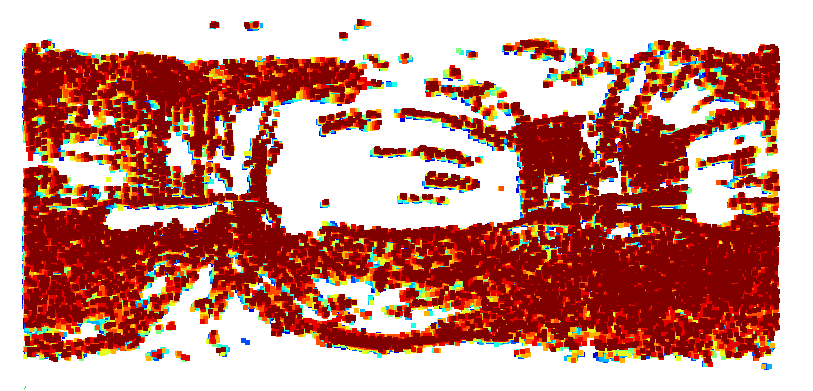

# Modeling-and-Camera-Trajectory

Репозиторий "3D-Modeling-and-Camera-Trajectory" содержит решение для построения траектории камеры и 3D модели помещений на основе панорамных сферических изображений. Программа обрабатывает изображения из папок 'sphere_sfm' и 'site_capture', используя библиотеку OpenSfM для создания облака точек и траектории камеры. Результаты экспортируются в форматы .ply и .csv для дальнейшего анализа и визуализации.

Основные возможности:
1. Преобразование панорамных сферических изображений в формат, подходящий для обработки.
2. Построение 3D модели помещений и облака точек.
3. Восстановление траектории камеры на основе обработанных изображений.
4. Экспорт результатов в удобные форматы для дальнейшего использования.

# The result of the program

# Лицензия:
MIT License

